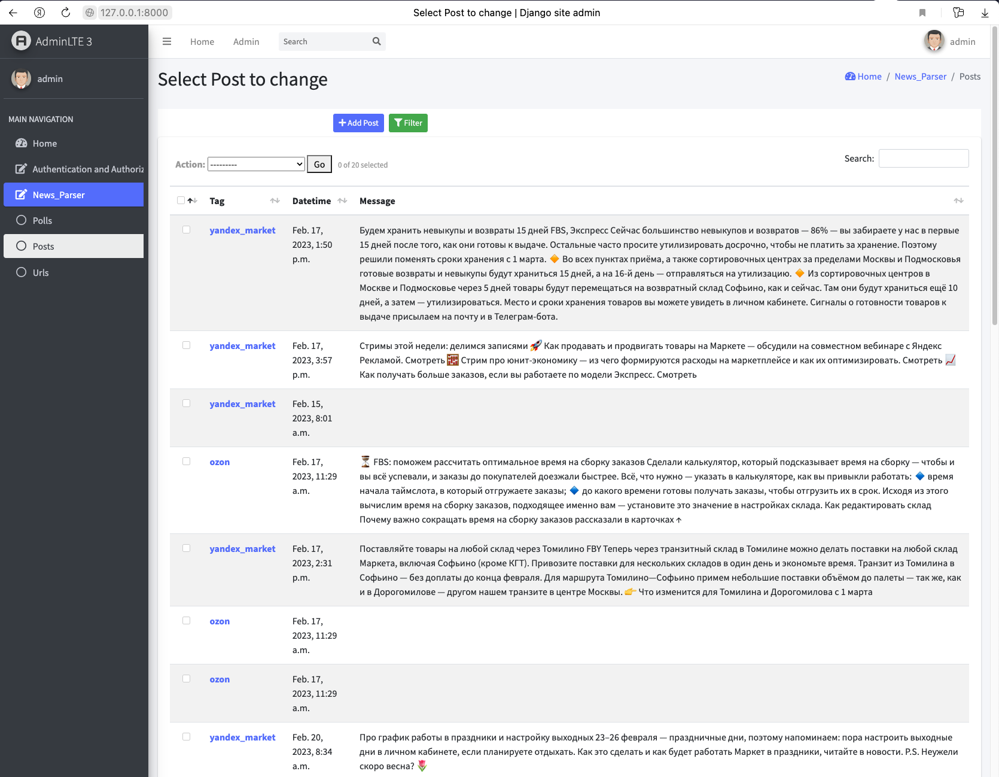

**Парсер новостных сайтов в Телеграмме**

Для запуска на чистую БД необходимо:

1) Установить все необходимые зависимости (pip install requirements.txt)
2) Осуществить Django миграции (python Django_admin/manage.py migrate)
3) Запустить парсер (python parser.py)

Результат работы:
